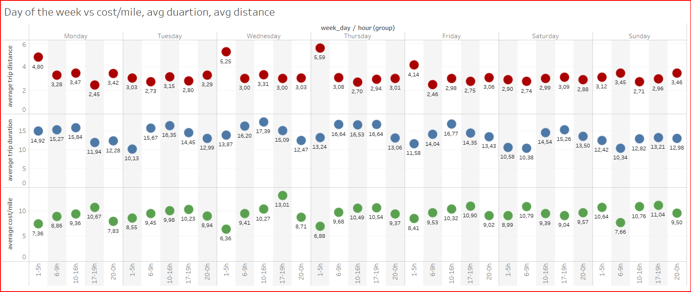
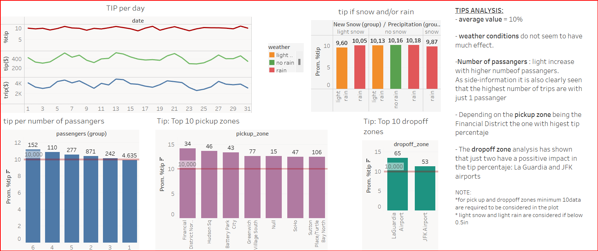

# PROJECT-V NYC TAXI ANALYSIS

In this project we will analize some data of the NYC taxis and cross information with a weather data base in order to see possible weather conditions effect.
For this analysis tools used are:
    1-Python
    2-MySQL
    3-Tableu
    
### Cleaning and transforming databases

<u>TAXI DATABASE </u>

Dates have been transformed to datetimes and columns for year, month and day have been added as well as one indicating the day of the week. 
Finally values with no distance nor total amount have been removed.

<u>WEAHTER DATABASE </u>

Temperature values have been transformed from Farenheit to Celsius. 
"T" values both for snow and precipitation that in the original database stand for "Traces" have been moved to 0.01 for analysis purposes.

### Analysis

<u>WEAHTER CONDITIONS </u>

No significative variations have been detected neither for duration nor for distance of the trip vs rain and/or snow conditions. 

<u>DAY OF THE WEEK </u>

In order to bring more information several time slots throughout the day have been analized (hours have been rounded to the closest hour): 
    - from 1 to 5
    - from 6 to 9
    - from 10 to 16
    - from 17 to 19
    - from 20 to 00

Analysis is ploted in Tableu:

<u>TIPS </u>
Tips average is 10%. Although weather has not an influence on it other parameters point out to have positive correlation with tip percentaje:
- number of passangers
- pickup zone
- dorpoff zone
Airports are the zones that both for pickup and droppof have an average tip percentaje grater than 10%.

TABLEU PROJECT: https://public.tableau.com/app/profile/patricia.saez/viz/PROJECTV/Story1?publish=yes